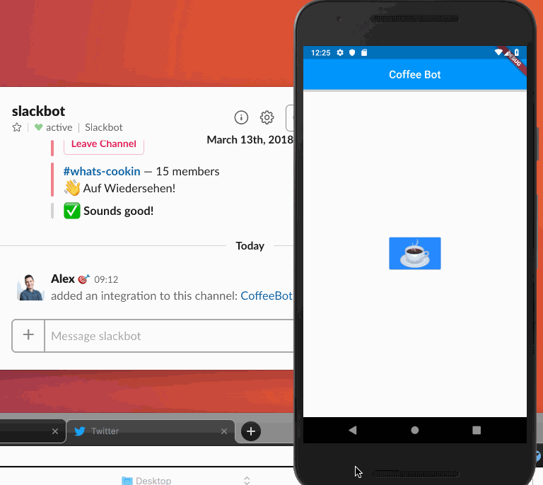

# coffee_bot

Have a coffee station at work? Want to alert your team that there is a fresh pot of hot, tasty, delicious coffee ready? With a press of a button, you can send a slack message to your Slack App to alert your them!

## Before you start, you need

- A slack app to accept incoming POST requests https://api.slack.com/apps
- Flutter SDK
- Dart

## Getting Started

- run `pub get` to obtain dependencies.
- environment configuration files are found in `lib/config`. Create your enviornments from the examples.
- running `lib/main.dart` uses the Development environment by default
- run `lib/config/{environment}.dart` to build for the desired environment

To build production run `flutter build apk lib/config/production.dart`. Otherwise `flutter run` will start a development enviornment.
